<h2>目錄</h2>

- [1. 前言](#1-前言)
- [2. 準備設定範本](#2-準備設定範本)
- [3. 修改 Default Profile](#3-修改-default-profile)
    - [3.1. 載入預設使用者登錄區](#31-載入預設使用者登錄區)
    - [3.2. 修改並合併登錄檔路徑](#32-修改並合併登錄檔路徑)
    - [3.3. 解除載入登錄區](#33-解除載入登錄區)
- [4. 清理現有 Shadow User 使設定生效](#4-清理現有-shadow-user-使設定生效)

## 1. 前言

在 CyberArk 的標準連線中，PSM-SSH 的預設視窗字體往往過小，長時間維運容易造成視覺疲勞。然而，PSM 伺服器並不像一般電腦可以直接在介面上修改字體後永久保存。

這是因為 PSM 採用 **「陰影使用者 (Shadow Users)」** 機制：每次連線時，系統都會動態建立一個臨時帳號來執行連線程式。為了讓以後「每一位」新產生的 Shadow User 都能看到大字體，我們必須修改 PSM 伺服器上的 **「預設使用者設定檔 (Default User Profile)」**。

## 2. 準備設定範本

由於 PuTTY 的外觀設定機碼包含複雜的編碼，手動撰寫極易出錯。我們建議在任一台有安裝 PuTTY 的電腦（不一定要在 PSM 伺服器上）先產生正確的設定範本。

1. **調整外觀**：開啟 PuTTY，進入 `Window` > `Appearance` > `Font settings` 點選 **Change**。

    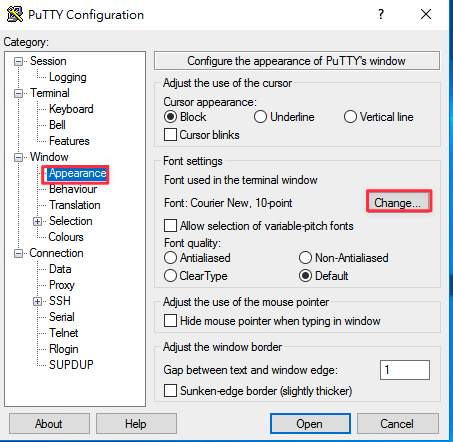

2. **設定字型**：選擇偏好的字型（如：{==Consolas==}）及字體大小（如：{==16==}），點擊 **OK**。

    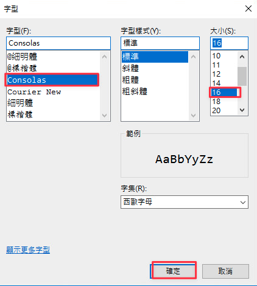

3. **儲存為預設值**：回到 `Session` 頁籤，點選左側最上方的 **Default Settings**，然後按下右側的 **Save**。這會將設定寫入您目前的 Windows 登錄檔中。

    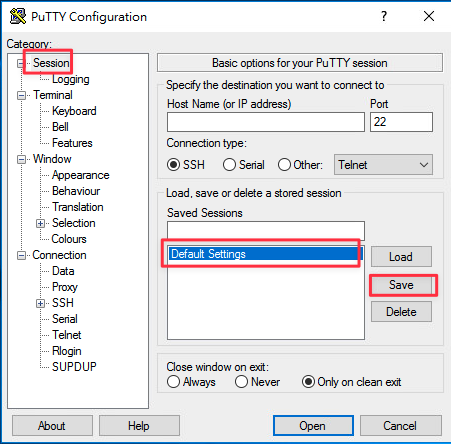

4. **匯出範本檔**：
    - 按下 `Win + R` 輸入 `regedit` 開啟登錄檔編輯器。
    - 導覽至：`HKEY_CURRENT_USER\Software\SimonTatham\PuTTY\Sessions\Default%20Settings`。
    - 在該機碼上按**右鍵** > **匯出**，儲存為 `DefaultPutty.reg`。

    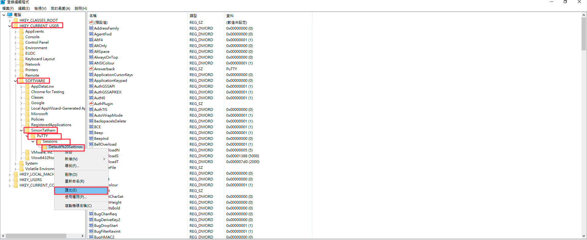

    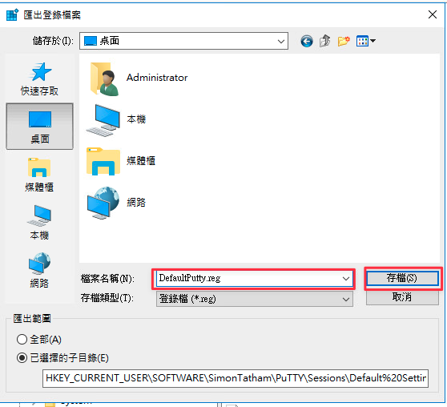

## 3. 修改 Default Profile

取得 `DefaultPutty.reg` 後，將其複製到 **PSM 伺服器**桌面。接下來我們需要利用「載入登錄區」技術，將設定強行寫入系統底層。

### 3.1. 載入預設使用者登錄區

!!! info "原理說明：什麼是載入登錄區 (Load Hive)？"
    登錄檔在硬碟中是以實體檔案（Hive）的形式存在。平常開啟 `regedit` 只能改到「目前登入帳號」的設定；但我們現在要改的是「未來才要產生的帳號」。
    
    這就像是**把另一顆硬碟拔下來，暫時插到你的電腦上讀取一樣**。我們強制掛載系統的預設範本檔（`C:\Users\Default\NTUSER.DAT`），將其命名為 `DefaultPutty`，這樣我們就能直接編輯這個「尚未被使用的範本檔案」。

1. 以管理員權限開啟 PSM 上的 `regedit`。
2. 選取左側 `HKEY_USERS` 資料夾。

    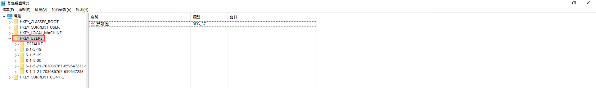

3. 點擊選單 **「檔案」 > 「載入登錄區」**。

    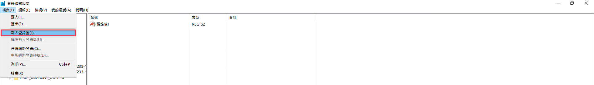

4. 選取路徑：`C:\Users\Default\NTUSER.DAT`（若看不見檔案，請直接輸入檔名）。

    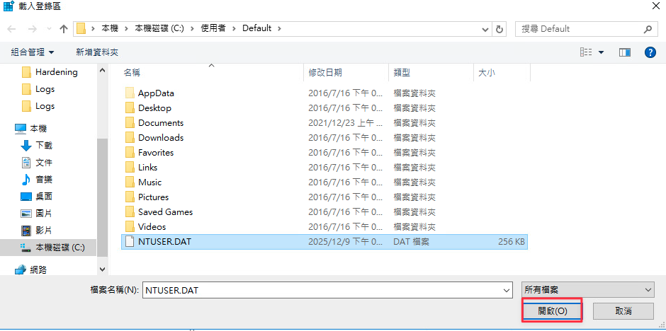

5. **機碼名稱** 請務必輸入：{==DefaultPutty==}。

    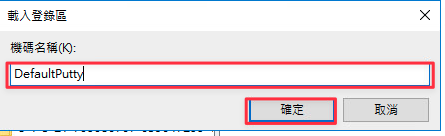

### 3.2. 修改並合併登錄檔路徑

因為匯出的 `.reg` 檔案原始路徑是指向「目前使用者 (HKEY_CURRENT_USER)」，我們必須將其修改為指向我們剛才「外掛」進來的範本路徑。

1. 以**記事本**開啟 `DefaultPutty.reg`。
2. 使用取代功能（Ctrl+H）替換路徑：
    - **尋找目標**：`[HKEY_CURRENT_USER\SOFTWARE\SimonTatham\PuTTY\Sessions\Default%20Settings]`

    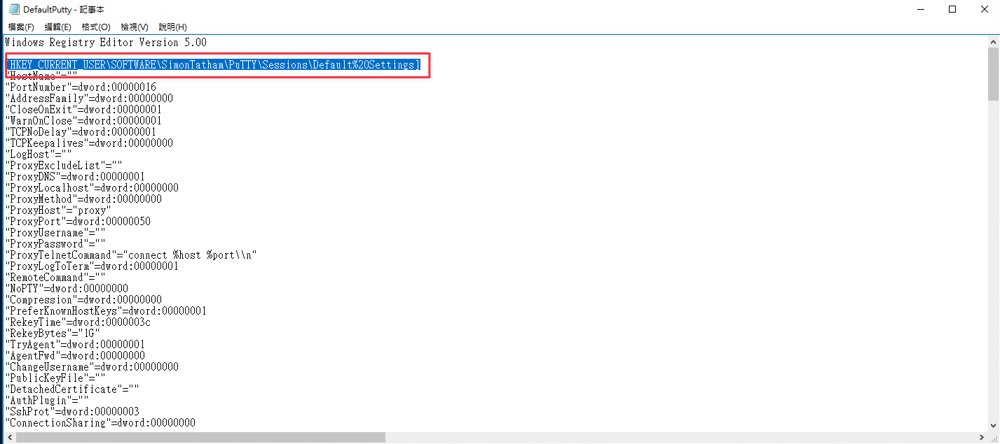

    - **取代為**：`[HKEY_USERS\DefaultPutty\Software\SimonTatham\PuTTY\Sessions\Default%20Settings]`

    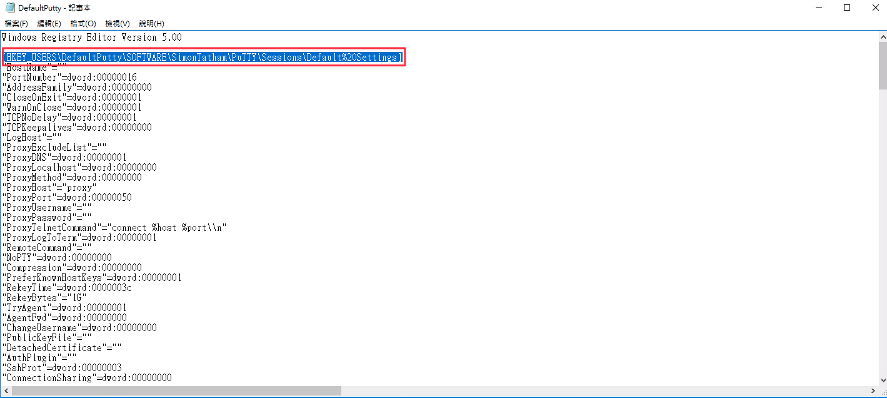

    !!! warning "關鍵提醒"
        取代路徑中的 `{==DefaultPutty==}` 名稱，必須與 3.1 節步驟 5 中手動定義的機碼名稱完全一致。

3. 儲存後，**雙擊執行** `DefaultPutty.reg` 進行合併。

    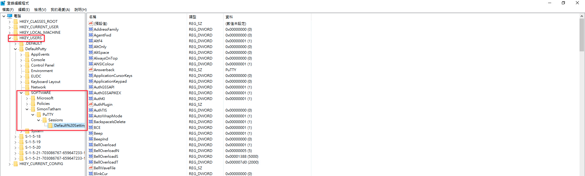

### 3.3. 解除載入登錄區

完成寫入後，必須安全地「拔除」這個範本檔案。

1. 在 `regedit` 中選取 `HKEY_USERS\DefaultPutty`。

    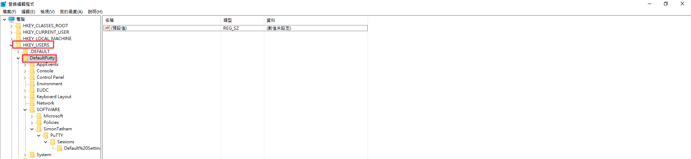

2. 點擊選單 **「檔案」 > 「解除載入登錄區」**，並在確認視窗點選「是」。

    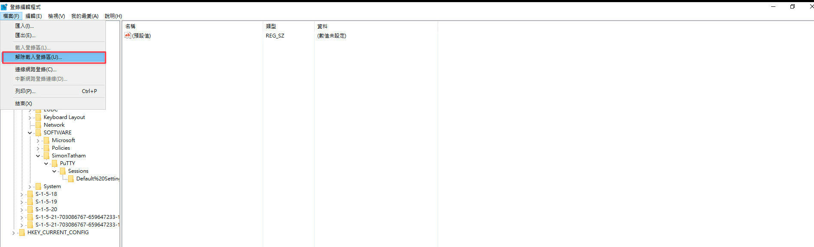

    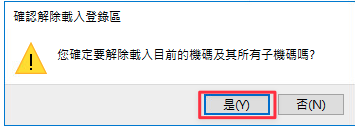

## 4. 清理現有 Shadow User 使設定生效

此設定僅對「新產生」的帳號有效。如果 PSM 伺服器上已經存在舊的 Shadow User 紀錄（名稱通常為 `PSM-` 開頭加上一串數字），必須將其刪除才會套用此設定。

1. **進入設定**：在 PSM 伺服器點選 **「進階系統設定」** > 「使用者設定檔」 > **「設定」**。

    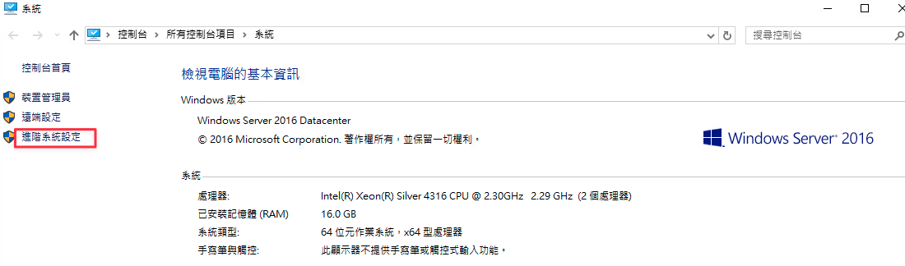

    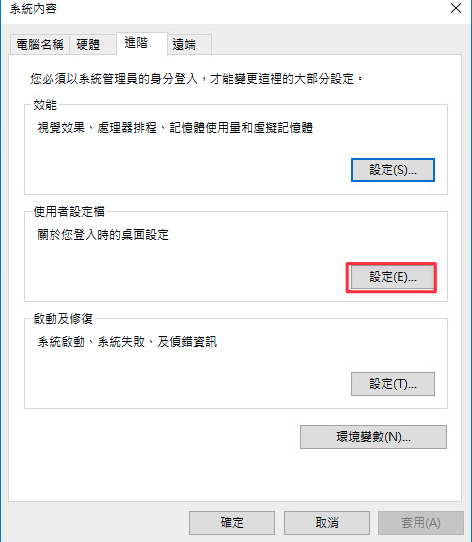

2. **刪除舊 Profile**：選取所有 `PSM-XXXXXXXX` 開頭的項目點擊 **「刪除」**。
    > **注意**：請勿刪除 `PSMConnect` 與 `PSMAdminConnect`。

    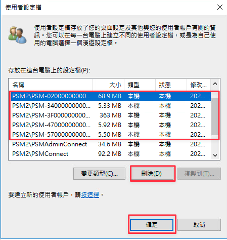

3. **檢查殘留**：確認 `C:\Users\` 資料夾下已無對應的 `PSM-` 資料夾。
    - 檢查 `C:\Users\` 是否還有殘留資料夾。

    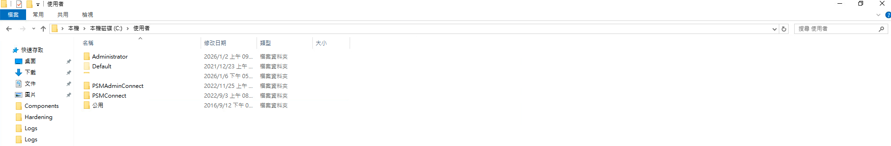

    - 檢查登錄檔 `ProfileList` 中無相關 PSM 帳號 SID 殘留。

    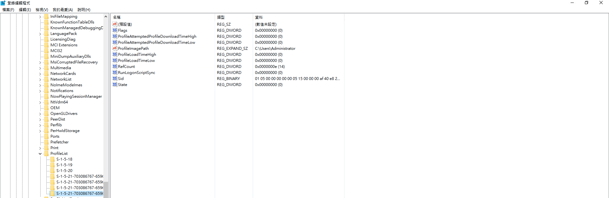

下次連線時，系統會自動根據您修改好的「預設範本」建立新帳號，字體設定便會生效。

---

<h2 class="no-print">參考資料</h2>

- [000032541 - How to customize the font and font size for the default PSM-SSH connection](https://community.cyberark.com/s/article/How-to-customize-the-font-and-font-size-for-the-default-PSM-SSH-connection-component-via-registry){:target="_blank" class="no-print"}
