<h2>目錄</h2>

- [1. 環境說明](#1-環境說明)
- [2. 憑證條件](#2-憑證條件)
- [3. 建立憑證範本](#3-建立憑證範本)
- [4. 發佈範本](#4-發佈範本)
- [5. 憑證請求](#5-憑證請求)
- [6. 測試](#6-測試)

## 1. 環境說明

- Windows版本：Windows Server 2022 Standard
- Windows CA  類型：Entriprise  CA

## 2. 憑證條件

LDAPS  所使用的憑證需符合以下條件

- 在 Local Computer\Personal 或 NTDS\Personal，且有私鑰。

- EKU 含 Server Authentication (1.3.6.1.5.5.7.3.1)。

- Subject/SAN 有 DC 的 FQDN。

- 憑證鏈完整且 client/DC 都信任 Root CA。

- 沒有啟用強式私鑰保護，CSP/KSP 是 Schannel 支援的。

## 3. 建立憑證範本

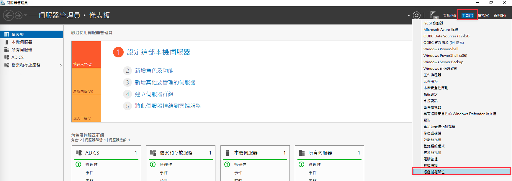

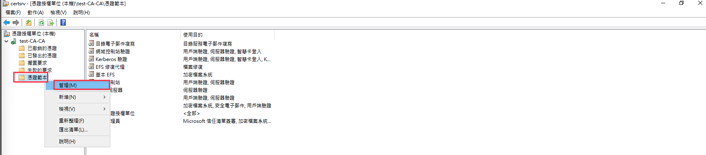

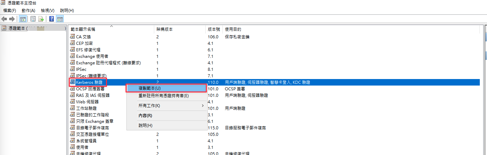

範本顯示名稱可自定義，有效期間及更新間隔則依需求更改

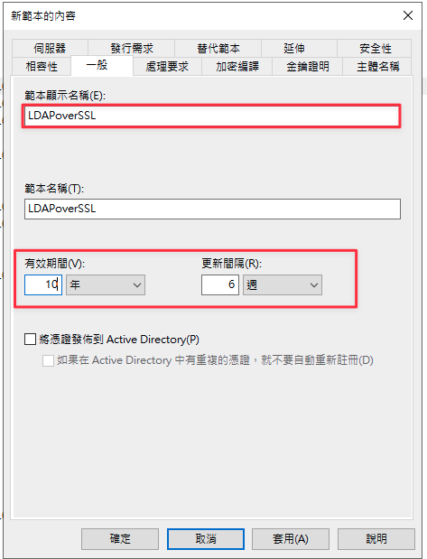

勾選允許匯出私密金鑰

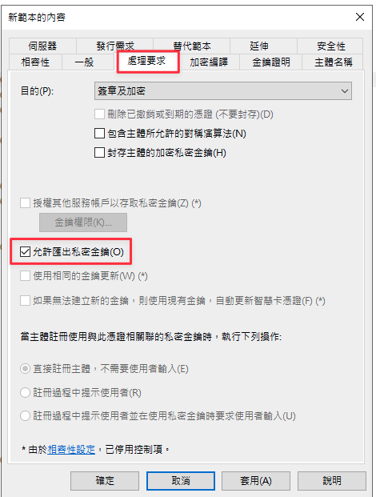

需勾選DNS 名稱 及 服務主題名稱 (SPN)

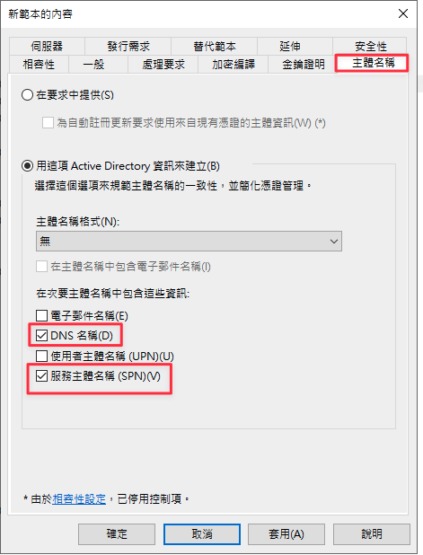

## 4. 發佈範本

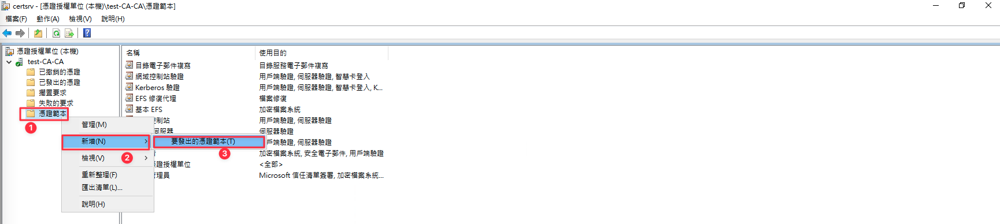

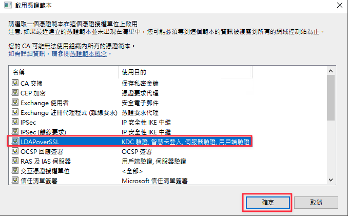

## 5. 憑證請求

於網域控制站執行憑證請求，若有多台網域控制站均要開啟LDAPS功能則需要在每一台均執行一次

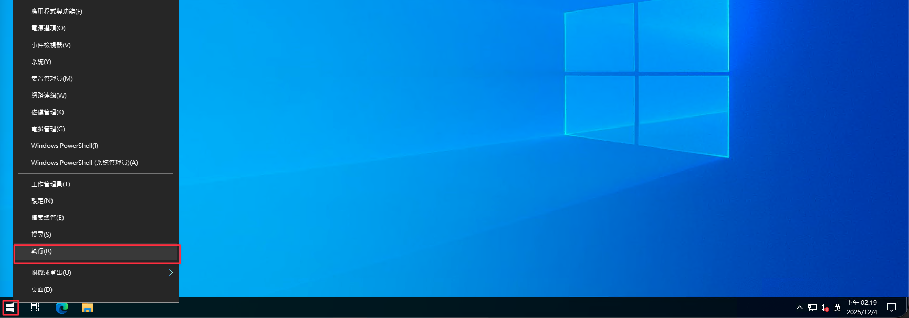

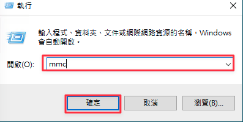

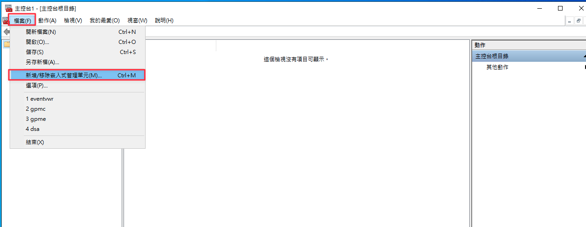

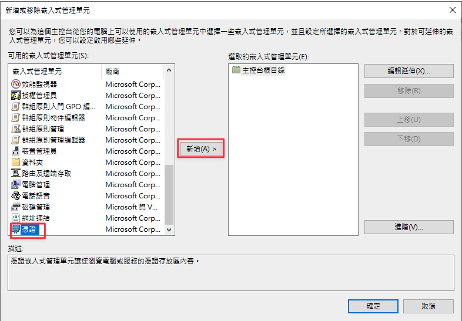

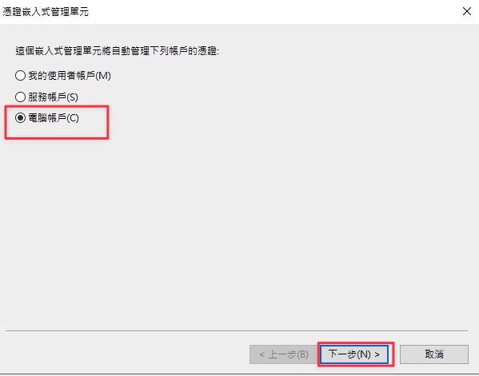

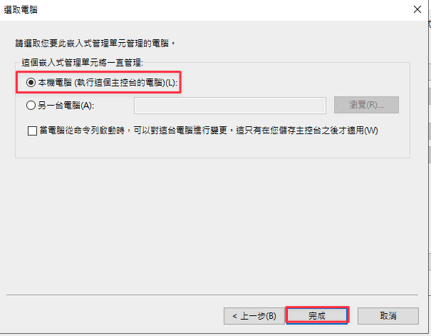

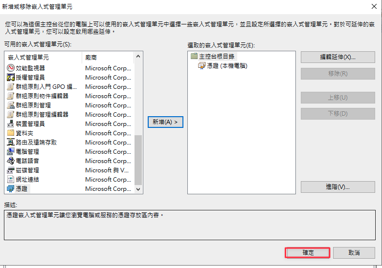

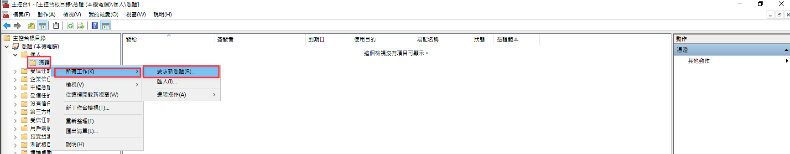

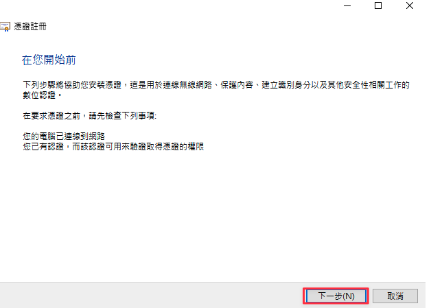

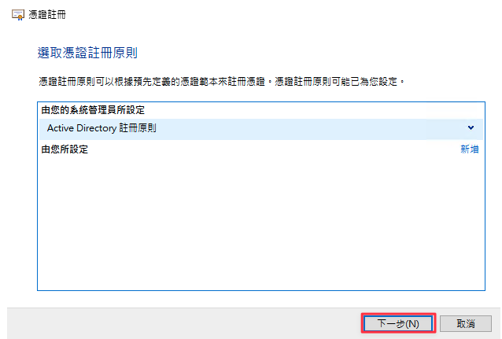

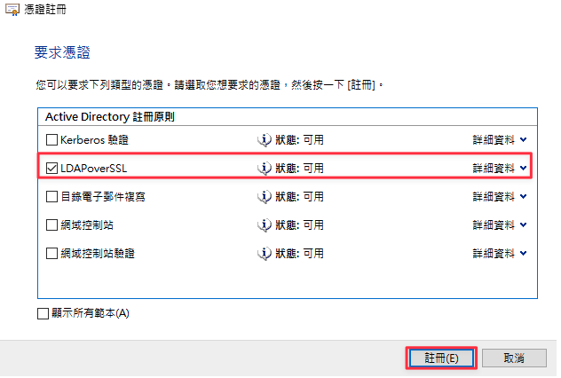

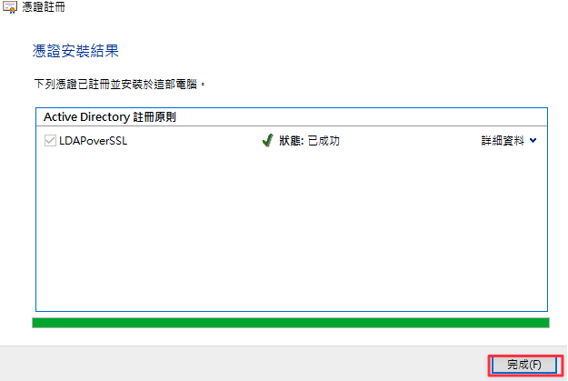

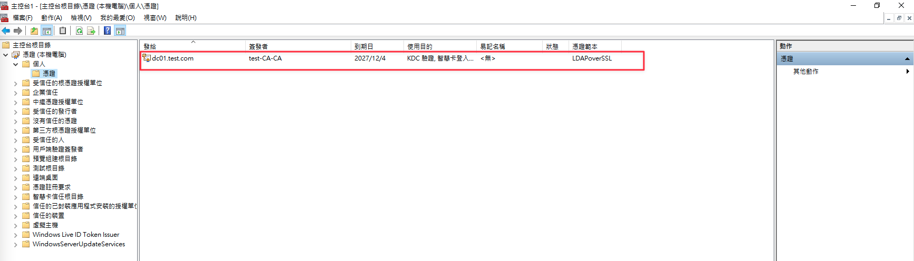

## 6. 測試

可以於網域控制站使用ldp.exe測試LDAPS是否可以正常連線

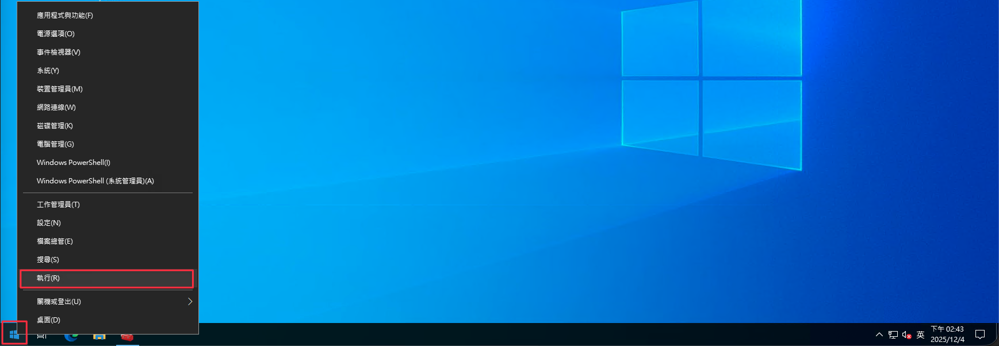

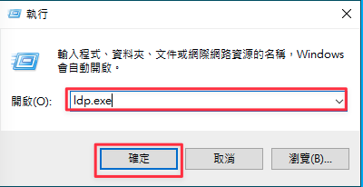

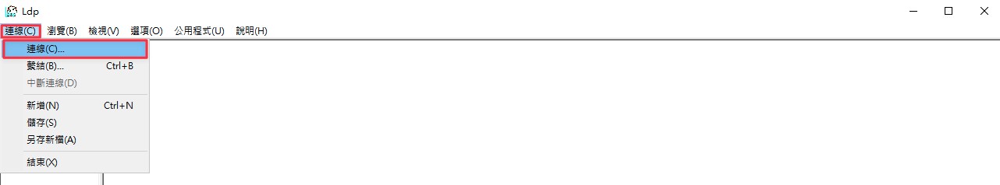

伺服器填寫  localhost，連接埠填寫  636，勾選  SSL，點擊確認

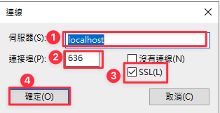

若成功會出現以下畫面

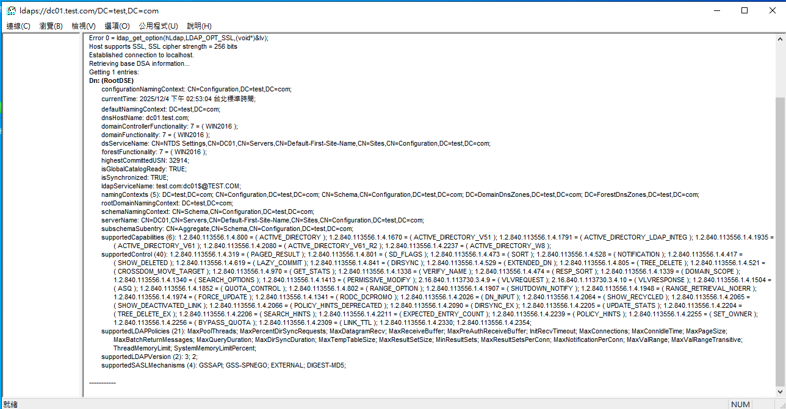

若連線失敗會出現以下畫面

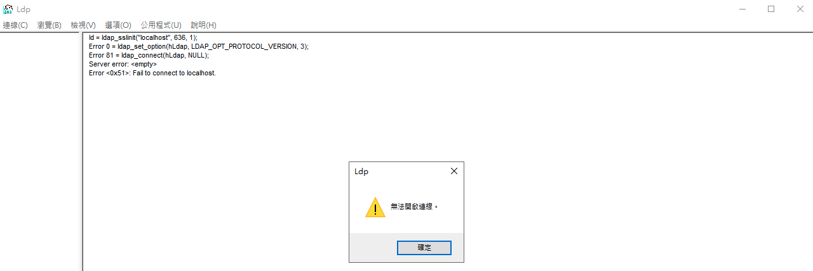

<h2 class="no-print">參考資料</h2>

- [LDAP over SSL (LDAPS) Certificate](https://learn.microsoft.com/en-us/archive/technet-wiki/2980.ldap-over-ssl-ldaps-certificate){:target="_blank" class="no-print"}
- [Enable LDAP over SSL with a third-party certification authority](https://learn.microsoft.com/en-us/troubleshoot/windows-server/active-directory/enable-ldap-over-ssl-3rd-certification-authority){:target="_blank" class="no-print"}